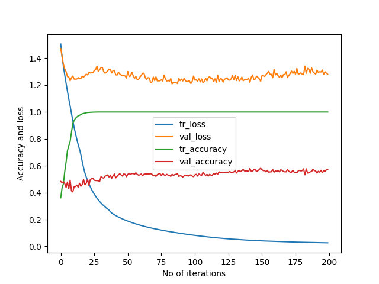

# DrivingDirection-6
99/99 [==============================] - 0s 4ms/step - loss: 0.0267 - accuracy: 1.0000 - val_loss: 1.2815 - val_accuracy: 0.5727  
[[172  22  22]   
 [ 51  26  17]   
 [ 58  21  58]]  
99/99 [==============================] - 0s 2ms/step - loss: 0.0410 - accuracy: 1.0000   
14/14 [==============================] - 0s 3ms/step - loss: 1.2283 - accuracy: 0.5817   
Train: 1.000, Test: 0.582   
[[173  20  23]   
 [ 51  26  17]   
 [ 55  21  61]]  
 
 
 
